# 🎮 GameVault — Catálogo de Videojuegos con Reseñas Propias

App Android nativa completa construida con **Jetpack Compose**, siguiendo **Clean Architecture (3 capas: Data / Domain / UI)**, **MVVM**, **Room**, **DataStore**, **Retrofit** y captura de fotos con la **Cámara** del dispositivo mediante **FileProvider** y permisos en tiempo de ejecución.

> **Proyecto Final Individual — Asignatura de Aplicaciones Móviles**  
> **Autor:** Nicolás Constante (LilChino99)  
> **Repositorio Oficial:** [github.com/LilChino99/proyecto-final](https://github.com/LilChino99/proyecto-final)

---

## 📱 Descripción de la App

**GameVault** es una plataforma personal para entusiastas de los videojuegos. La aplicación consume la API pública oficial de **IGDB v4 (por Twitch)** para ofrecer un catálogo actualizado con miles de videojuegos, incluyendo detalles como portada en alta resolución, calificación, géneros, plataformas y desarrolladores.

Adicionalmente, la app permite al usuario guardar sus propios videojuegos como **reseñados** localmente en una base de datos **Room**, redactar una opinión personal, asignar una calificación de 1 a 5 estrellas y **tomar una foto con la cámara física del dispositivo** (carátula, disco o pantalla) que se adjunta y guarda junto a la reseña.

---

## 🏛️ Arquitectura Elegida: Clean Architecture + MVVM + Repositorio

La aplicación está estructurada en **3 capas estrictas** para garantizar mantenibilidad, testabilidad y separación de responsabilidades:

```mermaid
graph TB
    subgraph "Capa de Presentación (UI Layer)"
        UI["Composables (Jetpack Compose)<br/>HomeScreen, GameDetailScreen, CreateReviewScreen..."]
        VM["ViewModels (StateFlow + UiState)<br/>HomeViewModel, GameDetailViewModel..."]
    end

    subgraph "Capa de Dominio (Domain Layer - Pure Kotlin)"
        Models["Modelos de Dominio<br/>Game, GameDetail, Review, UserPreferences"]
        Interfaces["Interfaces de Repositorio<br/>GameRepository, ReviewRepository, UserPreferencesRepository"]
    end

    subgraph "Capa de Datos (Data Layer)"
        RepoImpl["Implementaciones de Repositorio<br/>GameRepositoryImpl, ReviewRepositoryImpl..."]
        Remote["Retrofit + Twitch OAuth<br/>IgdbApiService, RetrofitClient"]
        LocalDB["Room Database<br/>GameVaultDatabase, ReviewDao, ReviewEntity"]
        LocalDS["DataStore Preferences<br/>UserPreferencesDataStore"]
        FileStore["FileProvider<br/>PhotoFileProvider"]
    end

    UI -->|"Observa StateFlow / Envía Eventos"| VM
    VM -->|"Consume contratos"| Interfaces
    Interfaces -.->|"Implementado por"| RepoImpl
    RepoImpl --> Remote
    RepoImpl --> LocalDB
    RepoImpl --> LocalDS
    RepoImpl --> FileStore
```



### Principios Fundamentales Implementados:
1. **Unidirectional Data Flow (UDF):** El estado fluye hacia abajo (`ViewModel` → `StateFlow` → `Compose UI`) y los eventos fluyen hacia arriba (`UI` → `ViewModel`).
2. **Capa de Dominio Pura:** La capa `domain/` no contiene ninguna importación de Android, Retrofit ni Room.
3. **Desacoplamiento Total:** Los ViewModels solo dependen de las interfaces de `domain/repository/`. Ningún ViewModel conoce a Retrofit ni a los DAOs de Room directamente.

---

## 🌐 API Utilizada: IGDB API v4 (Twitch Developer)

* **Documentación Oficial:** [api-docs.igdb.com](https://api-docs.igdb.com/)
* **Autenticación:** OAuth2 Client Credentials Flow en `https://id.twitch.tv/oauth2/token`.
* **Endpoints:** `POST https://api.igdb.com/v4/games` utilizando el lenguaje de consultas **Apicalypse**.
* **Headers requeridos:** `Client-ID` y `Authorization: Bearer <access_token>`.

---

## 📋 Cumplimiento de Requisitos Técnicos Obligatorios

| # | Requisito Técnico | Implementación en GameVault |
|:--|:---|:---|
| 1 | **UI y Navegación (Compose)** | 5 pantallas navegables (`Home`, `Detail`, `CreateReview`, `MyReviews`, `Settings`) con `NavHost`/`NavController` y `NavigationBar`. Uso de `LazyColumn` y carga de imágenes dinámicas con **Coil**. |
| 2 | **Arquitectura (MVVM + Repositorio)** | Estructura en 3 capas (`data`, `domain`, `ui`), `StateFlow`, `viewModelScope.launch` y manejo reactivo. |
| 3 | **Persistencia Local (Room + DataStore)** | **Room** para guardar reseñas locales con fotos. **DataStore** para persistir la preferencia de Modo Oscuro en tiempo real. |
| 4 | **Consumo de API Remota (Retrofit)** | Conexión con **IGDB API v4**, mapeo con Gson y manejo visible de los 3 estados: `Loading`, `Success` y `Error` (red/timeout). |
| 5 | **Hardware y Permisos (Cámara)** | Captura de foto con la cámara vía `ActivityResultContracts.TakePicture()`, `FileProvider` seguro y solicitud del permiso `Manifest.permission.CAMERA` en tiempo de ejecución con diálogo explicativo si es denegado. |
| 6 | **Despliegue y Firma** | Keystore RSA 2048-bit (`gamevault_release_key.jks`), `signingConfigs` en `build.gradle.kts`, generación de `.aab` firmado para Play Store y `.apk` de instalación directa. |

---

## 📂 Estructura del Proyecto

```
com.example.gamevault/
├── domain/                               # Capa de Dominio (Pure Kotlin)
│   ├── model/ (Game, GameDetail, Review, UserPreferences)
│   └── repository/ (GameRepository, ReviewRepository, UserPreferencesRepository)
├── data/                                 # Capa de Datos
│   ├── remote/
│   │   ├── api/ (IgdbApiService, RetrofitClient)
│   │   └── dto/ (IgdbDto, TwitchAuthResponseDto)
│   ├── local/
│   │   ├── db/ (GameVaultDatabase, ReviewDao)
│   │   ├── entity/ (ReviewEntity)
│   │   └── datastore/ (UserPreferencesDataStore)
│   ├── repository/ (GameRepositoryImpl, ReviewRepositoryImpl, UserPreferencesRepositoryImpl)
│   └── mapper/ (GameMapper, ReviewMapper)
└── ui/                                   # Capa de Presentación
    ├── navigation/ (NavGraph, Screen)
    ├── screens/ (HomeScreen, GameDetailScreen, CreateReviewScreen, MyReviewsScreen, SettingsScreen)
    ├── components/ (GameCard, ReviewCard, RatingBar, ErrorMessage, LoadingIndicator)
    ├── util/ (PhotoFileProvider)
    └── theme/ (Color, Theme, Type)
```
